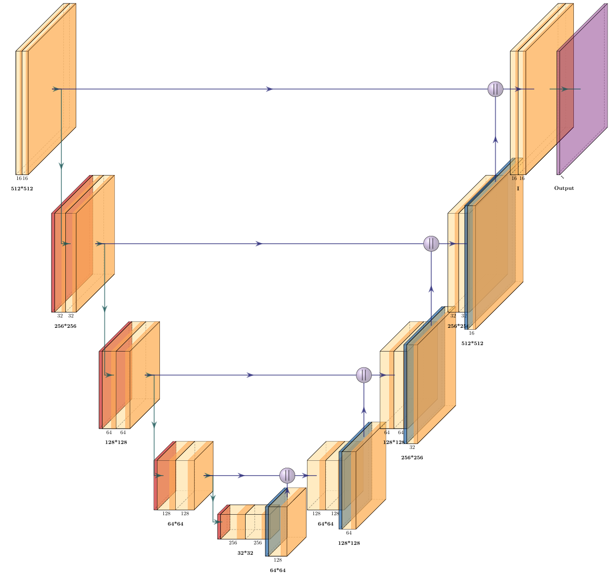
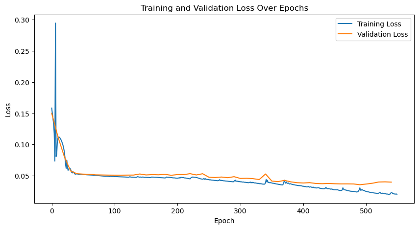
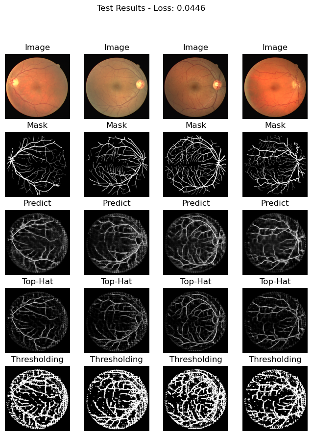
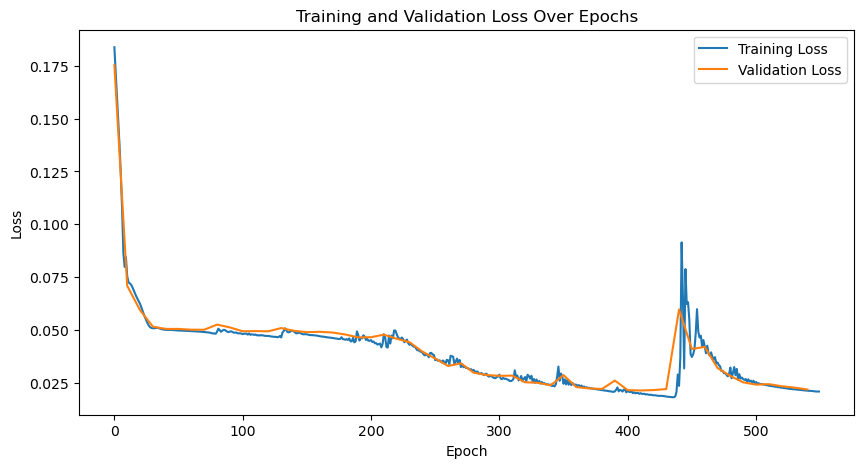
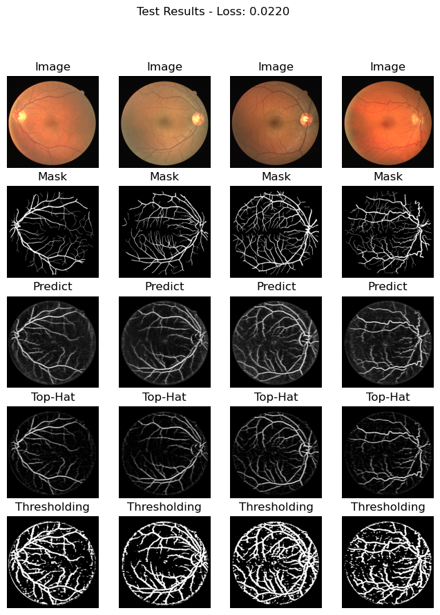
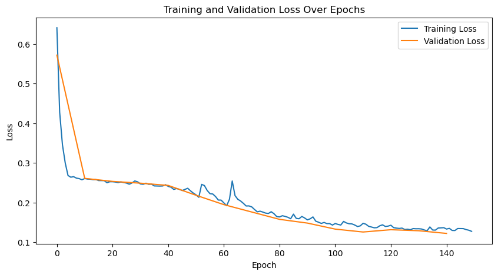
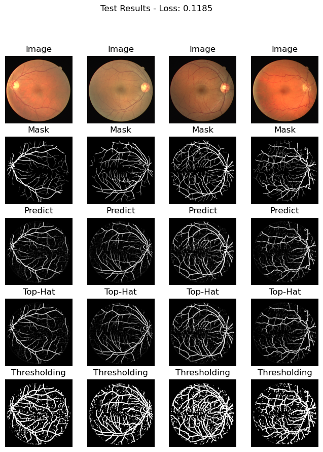
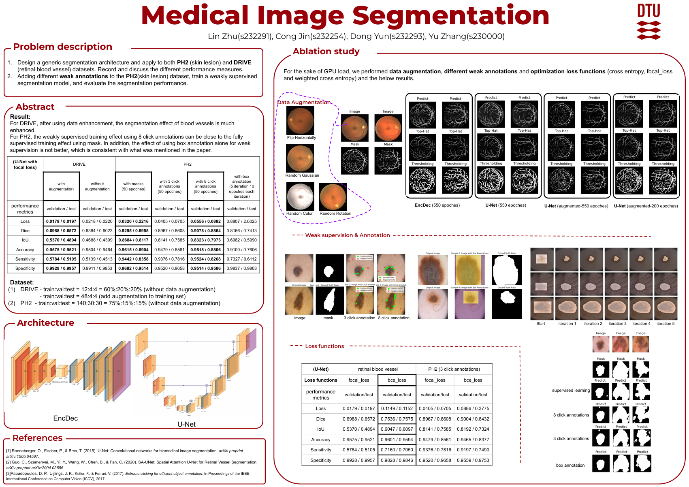

# Mini-project for Retinal blood vessel segementation

This is the project from **DTU-02516-IDLCV**, which aims to implement two architecture (**EncDec** & **U-Net**) for image segmentation. I used the DRIVE dataset and trained it on the a100sh (DTU-HPC). I evalute the performance on 5 different metrics (dice, loU, accuracy, sensitivity, specificity), and also try two different loss_function (**bce_loss** & **focal_loss**)

## Sections:
1. [Dataset](#dataset)
2. [Architecture](#architecture)
3. [Performance Metrics](#3-performance-metric)
4. [Loss Function](#4-loss-function)
5. [Result](#5-result)
6. [Poster](#poster)
7. [Reference](#reference)


## 1. Dataset

The dataset is DRIVE. 
- Since the dataset from teacher only has 20 images, I have to divide them into train:val:test = 12:4:4.
- Luckily, with the help of TA, I used the augmented dataset in his previous work [SA-UNet](https://github.com/clguo/SA-UNet/blob/master/DRIVE/download)


## 2. Architecture

We use two architectures in this project: **simple EncDec** and **UNet**, the main difference is UNet has the skip connection. Below is the architecture of UNet.
<!--  -->


## 3. Performance Metric

In image segmentation, various metrics are used to evaluate model performance. Here is an explanation of five commonly used metrics: **Dice**, **IoU**, **Accuracy**, **Sensitivity**, and **Specificity**.

#### (1) Dice Coefficient
- **Purpose**: The Dice coefficient (also known as the F1 score in binary classification) measures the similarity between the predicted segmentation mask and the ground truth. It is widely used in image segmentation tasks.
- **Formula**:

$$\text{Dice} = \frac{2 \times |A \cap B|}{|A| + |B|}$$

- **Advantages**:
  - **Sensitivity to Class Overlap**: Dice is particularly useful for measuring overlap and is effective in situations with imbalanced data, where one class (e.g., foreground) is much smaller than the other.
  - **Focus on Relevant Pixels**: Dice places more emphasis on correctly identifying the target region, which makes it especially useful for small or sparse targets in medical imaging.

#### (2) Intersection over Union (IoU)
- **Purpose**: IoU, also known as the Jaccard Index, is another overlap-based metric commonly used in segmentation tasks. It calculates the ratio between the intersection and the union of the predicted and actual target areas.
- **Formula**: 

$$\text{IoU} = \frac{|A \cap B|}{|A \cup B|}$$

- **Advantages**:
  - **Handles Overlapping Areas Well**: IoU provides a straightforward way to assess the degree of overlap between the predicted and true regions.
  - **Robust for Evaluation**: It is robust against small errors in prediction and is often used as a benchmark in segmentation tasks.

#### (3) Accuracy
- **Purpose**: Accuracy measures the overall correctness of the prediction by calculating the ratio of correctly classified pixels to the total number of pixels.
- **Formula**: 

$$\text{Accuracy} = \frac{\text{True Positives} + \text{True Negatives}}{\text{Total Number of Pixels}}$$

- **Advantages**:
  - **Easy Interpretation**: Accuracy is easy to interpret as a percentage of correctly classified pixels.
  - **Useful for Balanced Datasets**: When the dataset is balanced, accuracy provides a clear metric for model performance.

#### (4) Sensitivity (Recall)
- **Purpose**: Sensitivity (also known as Recall) measures the proportion of actual positives (e.g., target pixels) that are correctly identified by the model.
- **Formula**: 

$$\text{Sensitivity} = \frac{\text{True Positives}}{\text{True Positives} + \text{False Negatives}}$$

- **Advantages**:
  - **Emphasis on Identifying Positive Pixels**: Sensitivity is crucial in medical and anomaly detection tasks where missing a positive (e.g., lesion) is more critical than a false positive.
  - **Useful for Imbalanced Data**: It is effective in cases where the positive class (e.g., target region) is much smaller than the negative class.

#### (5) Specificity
- **Purpose**: Specificity measures the proportion of actual negatives (e.g., background pixels) that are correctly identified by the model.

- **Formula**: 
$$\text{Specificity} = \frac{\text{True Negatives}}{\text{True Negatives} + \text{False Positives}}$$

- **Advantages**:
  - **Reduces False Positives**: Specificity is essential in applications where avoiding false positives is critical.
  - **Balances with Sensitivity**: Alongside sensitivity, specificity provides a balanced view of model performance by focusing on the correct classification of background pixels.


## 4. Loss function

- **Binary Cross-Entropy Loss (BCE)**
$$\mathcal L_{BCE}(y, \hat y) = -\sum_i \left[y_i\log\sigma(\hat y_i) + (1-y_i)\log(1-\sigma(\hat y_i))\right].$$

The problem with this loss is that it tends to benefit the **majority** class (usually the background) relative to the **minority** class (usually the foreground). 

- Therefore, usually people apply weights to each class **(Weighted BCE)**:

$$\mathcal L_{wBCE}(y, \hat y) = -\sum_i \alpha_i\left[y_i\log\sigma(\hat y_i) + (1-y_i)\log(1-\sigma(\hat y_i))\right].$$

Traditionally, the weight $\alpha_i$ is defined as the inverse frequency of the class of that pixel $i$, so that observations of the minority class weight more relative to the majority class.

- **focal loss** which weights each pixel by the confidence we have in the prediction of that pixel.

$$\mathcal L_{focal}(y, \hat y) = -\sum_i \left[\left(1-\sigma(\hat y_i)\right)^\gamma y_i\log\sigma(\hat y_i) + (1-y_i)\log(1-\sigma(\hat y_i))\right].$$

A good value for $\gamma$ is generally 2.


## 5. Result
**(1) EncDec -> focal_loss -> Adam(lr=0.001) -> 550 epoches**

**Test Results: Loss: 0.0446, Dice: 0.4677, IoU: 0.3052, Acc: 0.9242, Sens: 0.3707, Spec: 0.9788**

<p align="center">
    
    
</p>

**(2) U-Net -> focal_loss -> Adam(lr=0.001) -> 550 epoches**

**Test Results: Loss: 0.0220, Dice: 0.6023, IoU: 0.4309, Acc: 0.9464, Sens: 0.4513, Spec: 0.9953**
<p align="center">
    
    
</p>

**(3) U-Net (with data augmentation) -> focal_loss -> Adam(lr=0.001) -> 150 epoches**

**Test Results: Loss: 0.1185, Dice: 0.7390, IoU: 0.5860, Acc: 0.9580, Sens: 0.6618, Spec: 0.9872**
<p align="center">
    
    
</p>

**(4) Feel free to play with any ablation study (You can change loss function, optimizer, learning rate or anything else). Besides, you change the threshold to display thresholding plot under different threshold. Under lower threshold, you will get more details including noise.**

Below is the code where you can change the threshold (In the section: **Train, validate model**):

```python
    plt.subplot(5, num_images_to_show, k+num_images_to_show*4+1)
    # Threshold the Top-Hat transformed image
    threshold = 0.06
    y_hat_binary = (y_hat_top_hat.squeeze() > threshold).astype(np.uint8)
    plt.imshow(y_hat_binary, cmap='gray')
    plt.title('Thresholding')
    plt.axis('off')
```

## Poster
- I'm responsible for the whole Retinal blood vessel segementation and some click annotations and training of skin lesion segmentation. Besides, I made the whole poster.
- $Cong$ and $Dong$ are responsible for the skin lesion segementation. 
- $Yu Zhang$ did nothing.

We got the average score and feedback that Professor said that Yu zhang almost knew nothing about the project during the presentation. Even when I told professor yu did nothing and I did the majority work, professor still gave me the same score as what yu got. Professor said that you are a team and you should make sure that anyone know the whole project.

**But I think this is unfair. I have no right to control whether he studies or not. I have already shouldered my due responsibility for this kind of group work cooperation, so I wrote this paragraph to express my feelings about the professor's rating. dissatisfied.**



## Reference
For more details about U-Net, refer to the original paper: [U-Net: Convolutional Networks for Biomedical Image Segmentation](https://doi.org/10.1007/978-3-319-24574-4_28) by Ronneberger et al., MICCAI 2015.
