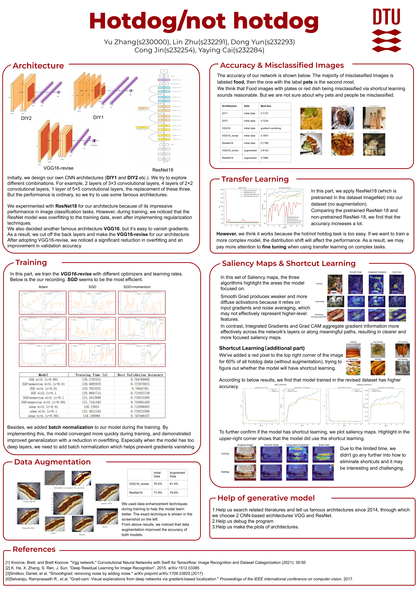
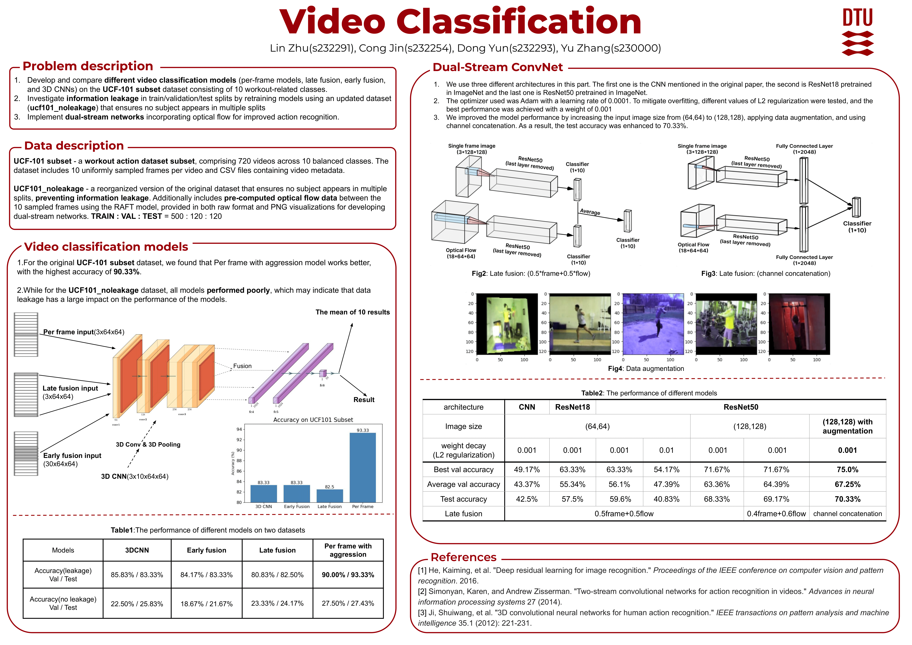

# 4 Projects in Course - Introduction to Deep learning in Computer Vision

These are 4 projects from **DTU-02516-IDLCV**, which includes **Classification**, **Segementation**, **Object dectection** and **Video**. We store the scripts and datasets in each directory.

## Classification
- We did a Hotdog/ not Hotdog classifier.
- explore the influence of different combinations of optimizer and learning rate.
- Discover shortcuts in images and explore their impact.

## Segmentation
- We did segmentation task on PH2(skin lesion) and DRIVE(retinal blood vessels) datasets.
- We utilize U-net with different metrics.
- leverage weak supervision and annotation.

## Object Detection
- Develop a CNN-based object detection system using object proposals on the Potholes dataset
- Compare the performance of CNN, CNN(with box regression) and Fast RCNN.

## Video
- Develop and compare different video classification models (per-frame models, late fusion, early fusion, 
and 3D CNNs) on the UCF-101 subset dataset consisting of 10 workout-related classes.
- Investigate information leakage in train/validation/test splits by retraining models using an updated dataset 
(ucf101_noleakage) that ensures no subject appears in multiple splits
- Implement dual-stream networks incorporating optical flow for improved action recognition.

## Contribution
Although there are 4 authors in all posters, but actually only [Lin Zhu](https://github.com/ZhuMuMu0216), [Dong Yun](https://github.com/snoozybot) and Cong Jin made contribution.
